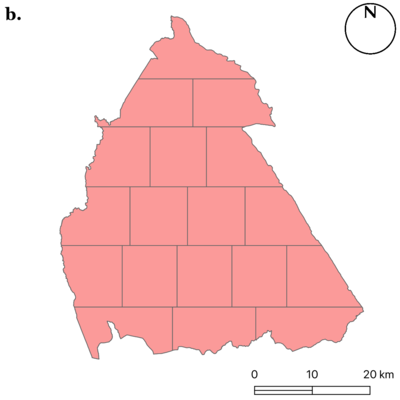
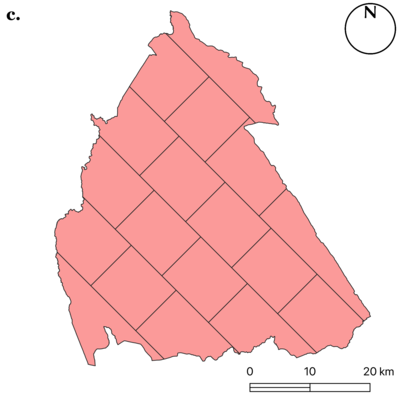

#  QGIS Polygon Divider Plugin

**Polygon Divider** is a plugin for [QGIS](http://www.qgis.org/en/site/) that takes a polygon and efficiently divides it into a number of 'squareish' polygons of a defined size, which is useful for a multitude of applications such as land parceling, environmental sampling, and so on.

As a simple worked example, you can take a polygon like this:

...and divide it into a number of smaller 'squareish' polygons of about 1000m2 *(it would be exactly 1000m2 if the polygon happened to have an area that precisely divides by 1000)*:

There are two options available to the user when dividing a polygon. The above uses the **absorb** method, whereby all of the polygons are slightly larger than the requested size, in order to 'absorb' any odd-sized 'offcuts' that would otherwise be left behind. The other alternative would be the **offcut** method. An example of this is given below, in which all of the polygons would be the precise size as requested, except for the light green one at the very top, which is the *'offcut'*:

The choice of which is best from the above will vary depending upon the specific requirements of the user, and the simplicity of the polygon in question. 

Each of the above cutting methods can be undertaken in 4 directions: **left-right**, **right-left**, **bottom-top** and **top-bottom**. Again, depending upon the shape of the specific polygon to be divided, better results might be achieved in some directions than others.

Each output polygon inherits all of the attributes from its parent, as well as the following additional attributes:

* `ps_id`: a unique integer ID for each output polygon
* `ps_uuid`: a version 4 [uuid](https://en.wikipedia.org/wiki/Universally_unique_identifier)
* `ps_area`: the area of the polygon
* `ps_repPointX`: the X coordinate of a point guaranteed to be within the resulting polygon *(not necessarily the geometric centroid, as this is not gurranteed to be within the resulting polygon)*
* `ps_repPointY`: the Y coordinate of a point guaranteed to be within the resulting polygon *(not necessarily the geometric centroid, as this is not gurranteed to be within the resulting polygon)*

The software should work well on some quite complex polygons:

...even if they are very large:

You can also set a rotation for the cutline. In the example below, the left image (labelled **b**) has the rotation set to 0&deg; and the right image (labelled **c**) has the rotation set to 45&deg; (both cut in the *left to right* direction):

 

#### Data Considerations:
The Polygon Divider expects **planar geometry** (x,y coordinates) and will not divide geographical coordinates (those in degrees, e.g., WGS84). 

If you want to divide a dataset that is stored in geographical coordinates (e.g., WGS84) you must save a new copy of your dataset (right click &rarr; export) using a **Projected Coordinate System**. I would recommend using an **equal area** projection (ideally a local equal area projection) to avoid distortion in the projection from affecting your results. You can either select a suitable projected CRS from the built-in selection in QGIS, or make a local equal area projection yourself using the [Projection Wizard](https://projectionwizard.org/) website and add it as a Custom CRS.  

Please note that setting the workspace CRS or right clicking on a layer and selecting "set CRS" is **not sufficient**, as neither of these approaches actually transforms the dataset!

#### Referencing the Plugin

If you use the plugin in academic work, or want to learn more about how it works, please use the reference to the journal article below:

[Huck, J. (2025). The QGIS Polygon Divider: Polygon partition into an irregular equal area grid. *Environment and Planning B: Urban Analytics and City Science*, 23998083251378340.](https://journals.sagepub.com/doi/full/10.1177/23998083251378340) 

#### Acknowledgements:

The QGIS2 (original) version of this plugin was funded by [Zero Waste Scotland Ltd.](http://www.zerowastescotland.org.uk/). The conversion to QGIS3 was funded by [Deutsche Forestservice GMBH](https://www.dfs-online.de/).

Development was greatly assisted by the accepted answer to [this](http://gis.stackexchange.com/questions/5300/dividing-polygon-into-specific-sizes-using-arcgis) forum post and the [pyroots](https://pypi.python.org/pypi/pyroots/0.1.0)  implementation of Brent's method.
