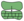
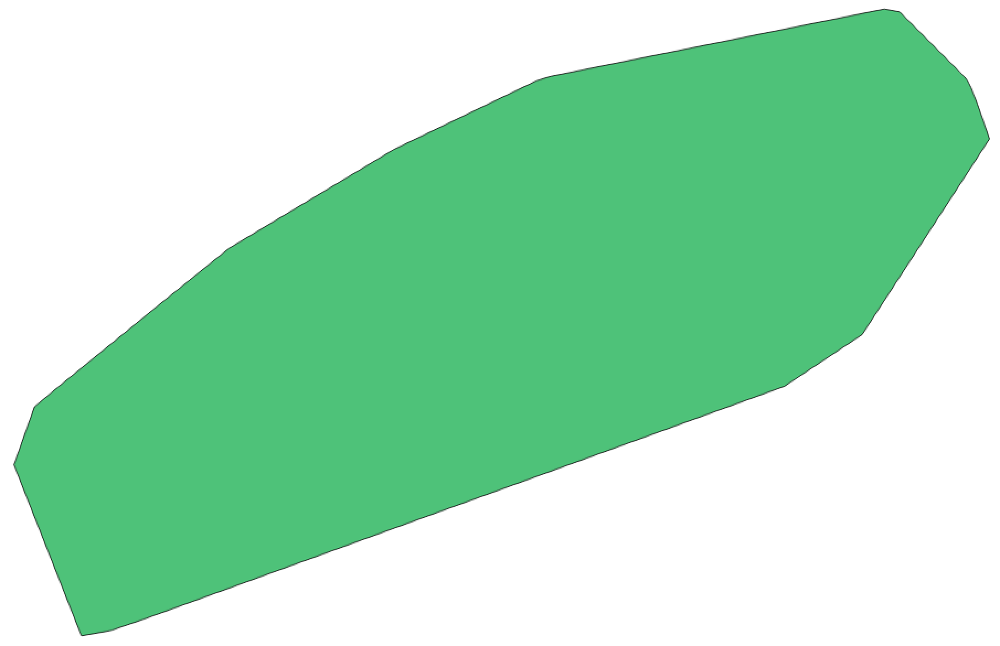
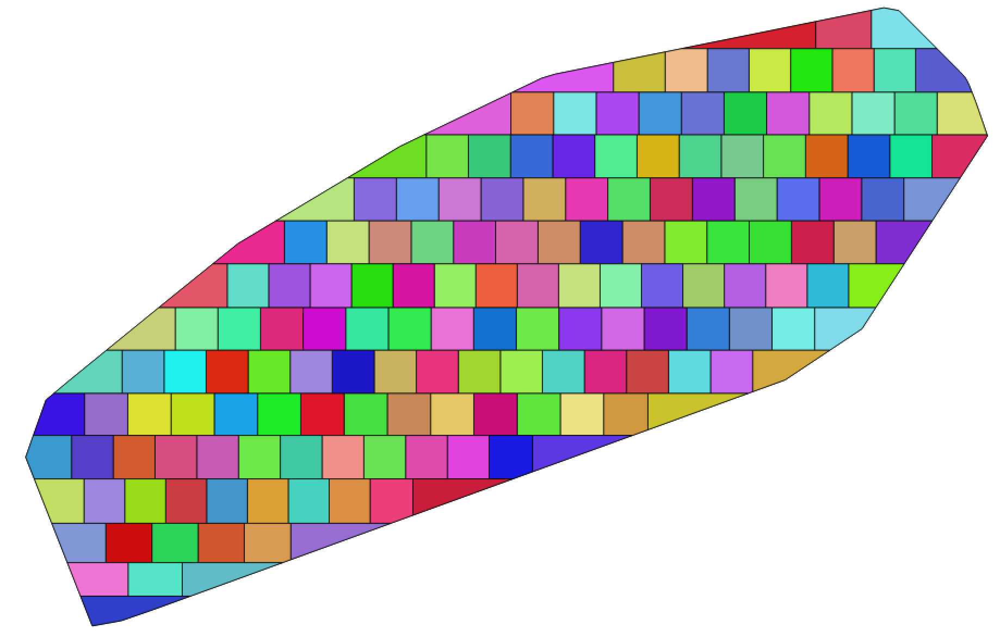
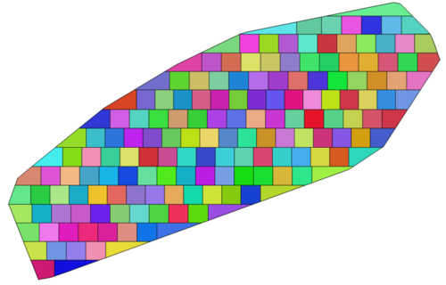
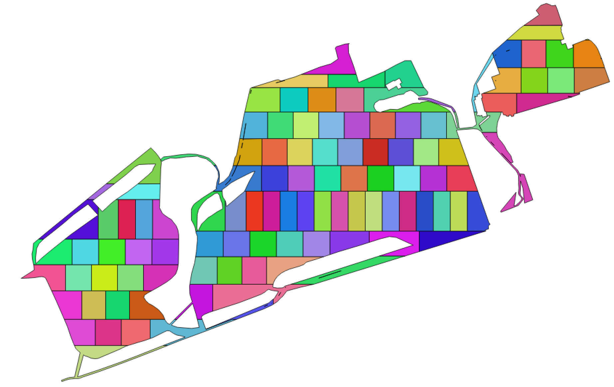
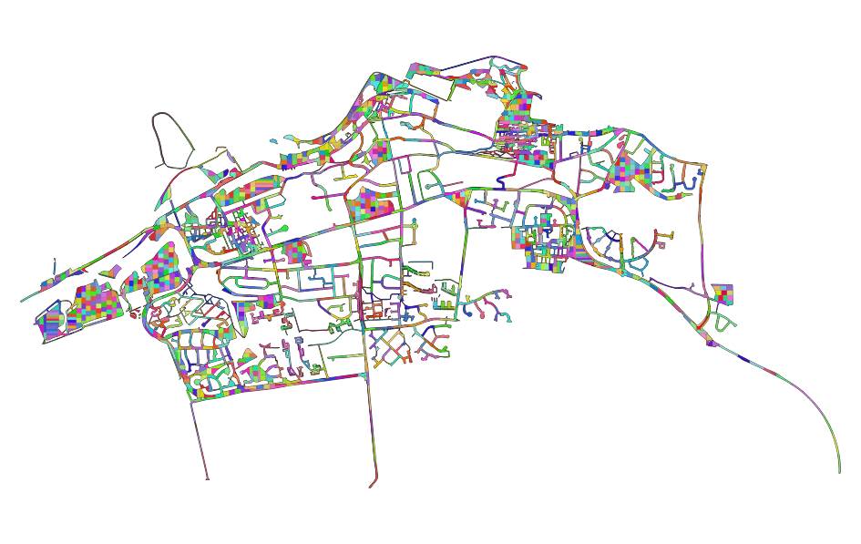

#  Polygon Divider QGIS Plugin

### Produced by [Roy Ferguson Consultancy Ltd](https://royferguson.co.uk/) for [Zero Waste Scotland Ltd](http://www.zerowastescotland.org.uk/).

**Polygon Divider** is a plugin for [QGIS](http://www.qgis.org/en/site/) that takes a polygon and efficiently divides it into a number of 'squareish' polygons of a defined size, which is useful for a multitude of applications such as land parceling, environmental sampling, and so on.

As a simple worked example, you can take a polygon like this:

...and divide it into a number of smaller 'squareish' polygons of about 1000m2 *(it would be exactly 1000m2 if the polygon happened to have an area that precisely divides by 1000)*:

There are two options available to the user when dividing a polygon. The above uses the **absorb** method, whereby all of the polygons are slightly larger than the requested size, in order to 'absorb' any odd-sized 'offcuts' that would otherwise be left behind. The other alternative would be the **offcut** method. An example of this is given below, in which all of the polygons would be the precise size as requested, except for the light green one at teh very top, which represente the *'offcut'*:

The choice of which is best from the above will vary depending upon the specific requirements of the user, and the simplicity of the polygon in question. 

Each of the above cutting methods can be undertaken in 4 directions: **left-right**, **right-left**, **bottom-top** and **top-bottom**. Again, depending upon the shape of the specific polygon to be divided, better results might be achieved in some directions than others.

Each output polygon inherits all of the attributes from its parent, as well as the following additional attributes:

* `ps_id`: a unique integer ID for each output polygon
* `ps_uuid`: a version 4 [uuid](https://en.wikipedia.org/wiki/Universally_unique_identifier)
* `ps_area`: the area of the polygon
* `ps_repPointX`: the X coordinate of a point guaranteed to be within the resulting polygon *(not necessarily the geometric centroid, as this is not gurranteed to be within the resulting polygon)*
* `ps_repPointY`: the Y coordinate of a point guaranteed to be within the resulting polygon *(not necessarily the geometric centroid, as this is not gurranteed to be within the resulting polygon)*

The software should work well on some quite complex polygons:

...even if they are very large:

In cases where the algorithm finds the geometry difficult to divide, it will make the polygons slightly less square and more rectangular (as is illustrated in both of the above examples). If you find that it doesn't manage to divide a certain geometry at all, then you can normally remedy this by simplifying it a little.

Please do get in touch with a copy of any polygons that do not work, they will help us continue to improve this plugin!

A standalone version of this plugin *(i.e. not dependent upon QGIS)* will be available shortly.

#### Acknowledgements:
The production of this plugin was funded by [Zero Waste Scotland Ltd.](http://www.zerowastescotland.org.uk/). Development was greatly assisted by the accepted answer to [this](http://gis.stackexchange.com/questions/5300/dividing-polygon-into-specific-sizes-using-arcgis) forum post and by the [pyroots](https://pypi.python.org/pypi/pyroots/0.1.0) Python implementations of Brent's method.